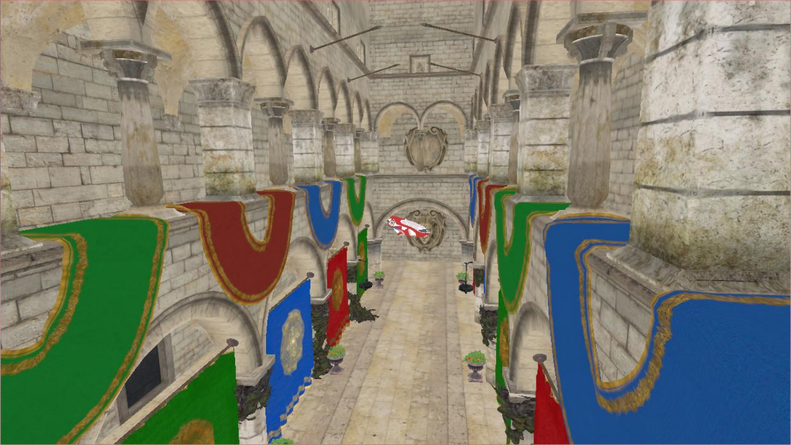
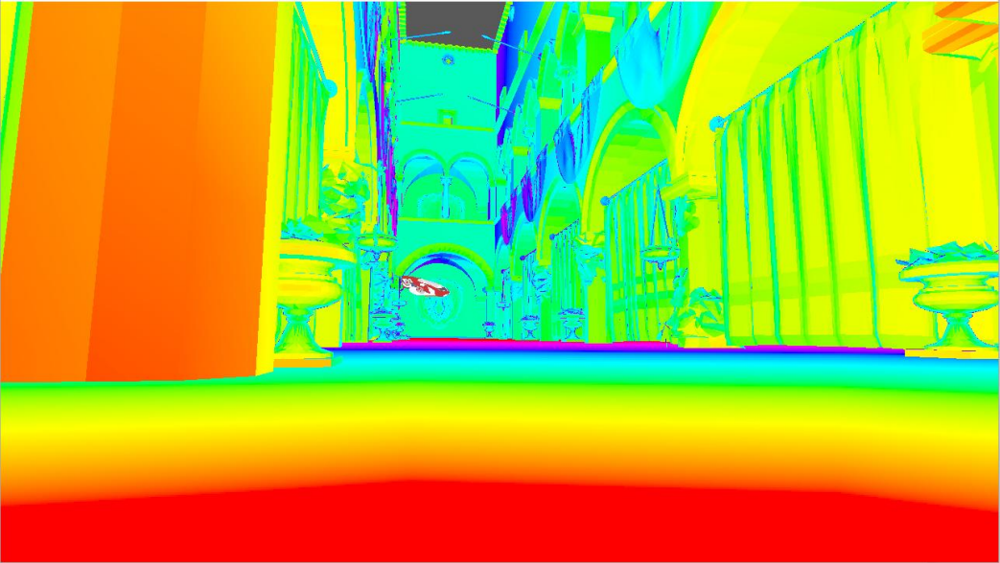
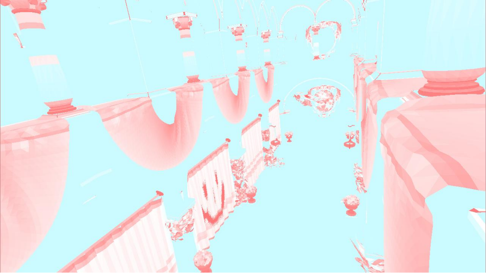
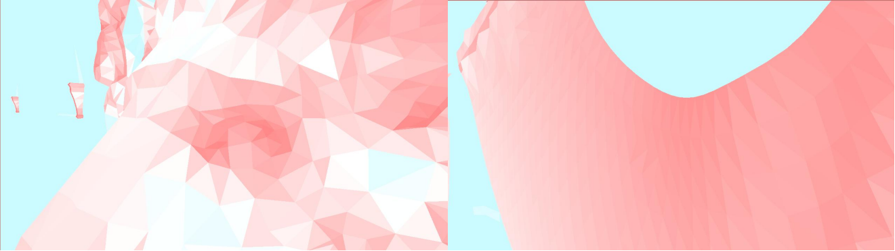

# vk_obj_loader_debugger
This is a Vulkan project that implements the loading and rendering of 3D scenes, using a single rendering pipeline to process textured and non-textured objs simultaneously. At the same time, MIPMAP visualization of interpolation in HSL color space and mesh density visualization of trilinear interpolation are realized.

## 3d Scene

## Visualization of MIPMAP

## Visualization of Mesh Density

